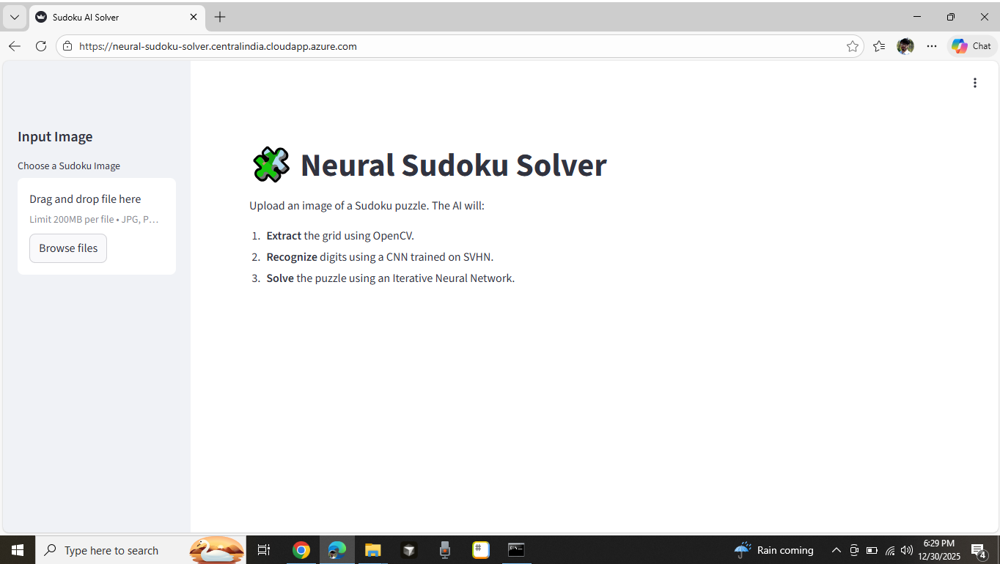
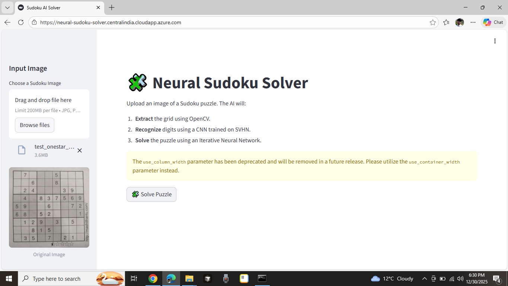
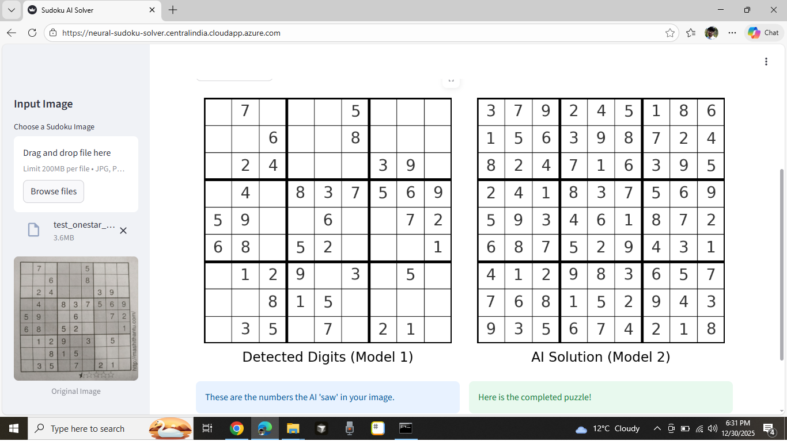
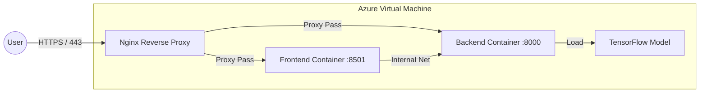

# 🧩 Neural Sudoku Solver

An AI-powered web application that solves Sudoku puzzles from images using Computer Vision and Deep Learning. 

Unlike traditional backtracking algorithms, this project uses a **Pure Neural Network approach** to solve the board iteratively, mimicking human intuition.


## 🚀 Features

* **Computer Vision Pipeline**: Automatically detects, crops, and processes Sudoku grids from raw images using OpenCV.
* **Digit Recognition (CNN)**: Recognizes handwritten or printed digits (1-9) using a CNN trained on the SVHN (Street View House Numbers) dataset.
* **Neural Solver**: A specialized Convolutional Neural Network that solves the puzzle iteratively by filling the "most confident" cell one at a time, rather than using recursion.
* **Full-Stack Interface**: 
    * **Backend**: FastAPI for high-performance inference.
    * **Frontend**: Streamlit for an interactive drag-and-drop UI.

---

## 📸 Screenshots (Demo)

Here is the step-by-step process of the AI solving a puzzle:

| **1. Original Image** | **2. Detected Grid** | **3. Solved Output** |
|:---:|:---:|:---:|
|  |  |  |

## 📂 Project Structure

```text
sudoku-deploy/
├── models/                  # Place trained .hdf5 models here
├── images/                  # Assets (e.g., zero_template.jpg)
├── src/                     # Core Logic
│   ├── image_processing.py  # OpenCV grid extraction & warping
│   ├── neural_solver.py     # Iterative neural solving logic
│   └── model_loader.py      # TensorFlow model management
├── app.py                   # FastAPI Backend
├── ui.py                    # Streamlit Frontend
├── Dockerfile               # Container config
└── requirements.txt         # Dependencies
```

🛠️ Installation & Setup
------------------------

### Prerequisites

1.  **Download Models**: You must download the trained models and zero_template.jpg and place them in the models/ and images/ directory respectively:
    
    *   digit\_svhn-196-0.14.hdf5
        
    *   sudoku\_conv-20-0.10.hdf5
        
2.  **Assets**: Ensure images/zero\_template.jpg exists.
    

### Option A: Run Locally (Standard)

 ```bash
pip install -r requirements.txt
 ```
    
```bash
uvicorn app:app --reload --host 0.0.0.0 --port 8000
```
    
```bash
streamlit run ui.py
```

Access the app at http://localhost:8501
    
### Option B: Run with Docker (Recommended)

```bash
docker-compose up --build
```
    
    *   Frontend: http://localhost:8501
        
    *   API Docs: http://localhost:8000/docs
        


## ☁️ Deployment & DevOps Architecture

This application is deployed on a **Microsoft Azure Virtual Machine (Standard B2s)** using a production-ready containerized architecture. It features a custom **Nginx Reverse Proxy** for security and traffic management, ensuring the backend APIs remain isolated from the public internet.

### 🏗️ Architecture Diagram



### 🔐 Key Infrastructure Features

-   **Docker Compose Orchestration**: The entire stack (Frontend, Backend, Proxy) is containerized and managed via Docker Compose, ensuring consistent environments across development and production.
    
-   **Nginx Reverse Proxy**:
    
    -   Acts as the single entry point (Gateway), handling all incoming HTTP/HTTPS traffic.
        
    -   **SSL Termination**: Secured with **Let's Encrypt** certificates (auto-renewing via Certbot).
        
    -   **Route Handling**: Directs `/` traffic to Streamlit and `/solve` traffic to FastAPI.
        
-   **Security Hardening**:
    
    -   **Firewall Rules**: Public access is restricted to ports 80/443 only.
        
    -   **Internal Networking**: The Backend (FastAPI) is isolated on an internal Docker network, inaccessible from the outside world.    

🧠 How It Works
---------------

1.  **Preprocessing**: The input image is thresholded and warped to a flat 9x9 grid using cv2.getPerspectiveTransform.
    
2.  **Cell Extraction**: The grid is sliced into 81 individual 32x32 pixel images.
    
3.  **Digit Classification**: A CNN model processes the 81 cells to identify existing numbers.
    
4.  **Iterative Solving**:
    
    *   The board state is fed into the Solver Network.
        
    *   The network predicts probabilities for all empty cells.
        
    *   The cell with the **highest confidence** is filled.
        
    *   This repeats until the board is full.
        

📄 License
----------

This project is open-source. 